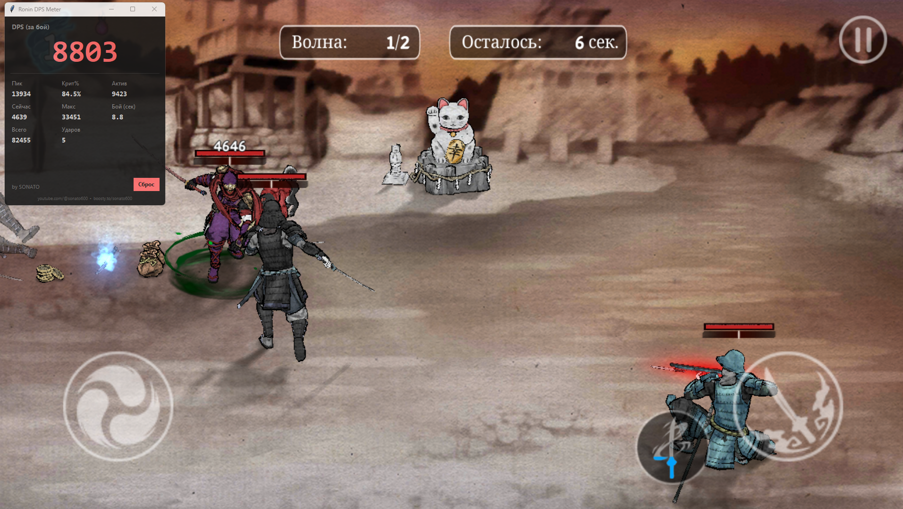

# Ronin DPS Meter — счётчик урона для Ronin: The Last Samurai

**Внешний DPS-метр для мобильной игры Ronin: The Last Samurai на эмуляторе (BlueStacks, LDPlayer, Nox, MEmu).** Читает урон прямо с экрана нейросетью — не трогает память игры, не модифицирует APK, не банится. Работает на CPU.

> *External vision-based DPS meter / damage counter for Ronin: The Last Samurai (Android emulator). No mod, no memory injection — reads damage numbers from the screen with a CNN. Runs on CPU.*




- ✅ **Не трогает игру** — только смотрит на экран, как видеорегистратор. Не банится.
- ✅ **Работает на любом эмуляторе** — BlueStacks, LDPlayer, Nox, MEmu — выбираешь область мышью.
- ✅ **На CPU** — не требует видеокарту. Работает на слабых ПК.
- ✅ **Полная статистика боя** — DPS текущий, пиковый, средний, всего урона, критов, макс удар, время боя.
- ✅ **DPS как в WoW Details** — effective (за весь бой) + activity (за активную атаку).
- ✅ **Работает с любым языком игры** — русская локализация (кириллица: «Волна», «Осталось», «УКЛОНЕНИЕ»), английская, китайская. Надписи интерфейса не путаются с уроном — нейросеть обучена их отсеивать.


## Установка (3 шага)

### 1. Скачай и распакуй

1. Скачай проект (зелёная кнопка Code → Download ZIP).
2. Распакуй папку куда-то удобно, например `C:\Games\ronin-dps-meter`.

### 2. Первый запуск: 1-INSTALL.bat

Дважды кликни **1-INSTALL.bat** — скрипт:
- Проверит, есть ли Python 3.10+ в системе.
- Установит нужные библиотеки (один раз, ~150 МБ).
- Сам всё настроит.

**Требование:** Python 3.10+ с галкой "Add Python to PATH".  
Если Python не установлен:
1. Скачай с https://python.org (нужна версия 3.10 или выше).
2. При установке **обязательно поставь галочку** ☑ "Add Python to PATH".
3. Запусти 1-INSTALL.bat снова.

## Использование

### Запуск

1. Запусти игру в эмуляторе.
2. Дважды кликни **2-RUN.bat**.
3. **При первом запуске** — экран затемнится. Зажми ЛКМ и обведи мышью игровое поле (где всплывает урон), отпусти.  
   Рамка сохранится в `config.json` — следующий запуск будет без обводки.
4. Играй! Оверлей DPS будет плавать на экране эмулятора.

### Переобвести область

Если поменял размер окна эмулятора или хочешь изменить область отслеживания:
- Дважды кликни **3-SELECT-AREA.bat** и обведи заново.

## Что показывает оверлей

| Метрика | Что это |
|---|---|
| **DPS (средний за бой)** | Главная крупная цифра: весь урон ÷ активное время боя. Растёт плавно, не скачет. |
| **Сейчас** | Мгновенный DPS за последние 5 секунд (может прыгать — это норма) |
| **Пик** | Максимальный мгновенный DPS за бой |
| **Всего** | Суммарный урон со всей сессии |
| **Крит%** | Процент урона, нанесённого критом (от общего) |
| **Макс** | Самый крупный одиночный удар |
| **Ударов** | Количество распознанных ударов за 5-сек окно |
| **Бой** | Активное время боя в секундах (в меню таймер замирает) |

**Кнопка "Сброс"** — обнулить счётчики (новый бой).

## ⚠️ Важное ограничение

**Метр считает только урон по БЛИЖНИМ врагам — тем, что в зоне видимости рядом с персонажем.**
- **Дальний бой и урон по дальним врагам НЕ учитываются** — цифры урона по далёким целям мелкие, появляются у края экрана или за кадром, и не распознаются надёжно.
- Метр читает крупные всплывающие числа урона вблизи. Это особенность подхода «чтение с экрана» (без доступа к памяти игры).
- Для ближнего боя (основной геймплей Ronin) DPS считается корректно.

## DPS считается как в WoW Details

Главная цифра **DPS (за бой)** = весь урон ÷ полное время боя (*effective* — как Details по умолчанию).
**Актив** = весь урон ÷ время, когда ты реально атаковал (*activity* — без простоев, всегда выше).
Это та же система, что в популярных метрах WoW (Details!/Recount).

## Советы для лучших результатов

1. **Растяни окно эмулятора** побольше — чем крупнее цифры урона, тем точнее распознавание.
2. **Какой эмулятор?** Любой — BlueStacks, LDPlayer, Nox, MEmu. Важно только чтобы окно с игрой было видно.
3. **Если метр виснет** — уменьши FPS в `config.json` (параметр `capture_fps`, по умолчанию 60).
4. **Наложение цифр** — при быстрых комбо цифры могут наложиться, редкие пропуски нормальны. Усреднённый DPS все равно верный.

## Как это работает (кратко)

```
Захват окна эмулятора
  ↓
Распознавание цифр урона нейросетью (CNN)
  ↓
Трекинг уплывающих вверх чисел урона
  ↓
Отсев помех: HP игрока (на полоске), хил, золото,
иероглифы и надписи на любом языке (кириллица/латиница/иероглифы),
авто-пауза в меню между этапами
  ↓
Расчёт DPS и метрик
```

**Не модифицирует игру, не лезет в память, не требует root.** Работает как OBS: просто смотрит на экран.

## Устранение проблем

| Проблема | Решение |
|---|---|
| "Python не найден" при запуске 1-INSTALL.bat | Установи Python 3.10+ с python.org, **не забудь галочку "Add to PATH"** |
| Оверлей не появляется | Убедись что окно эмулятора открыто и видно, и правильно выбрал область при первом запуске |
| Метр распознаёт неправильно | Увеличь окно эмулятора, попробуй `capture_fps: 30` в config.json |
| Программа зависает | Закрой эмулятор на время установки, запусти снова |

## Файлы проекта

```
ronin-dps-meter/
├── 1-INSTALL.bat         ← Запусти первым (один раз)
├── 2-RUN.bat             ← Запуск приложения
├── 3-SELECT-AREA.bat     ← Переобвести область если поменял размер окна
├── main.py               ← Главная программа
├── config.json           ← Настройки (область, таймауты и т.д.)
├── requirements.txt      ← Список библиотек
├── core/                 ← Мозг программы
│   ├── capture.py        ├─ захват окна
│   ├── matcher.py        ├─ распознавание цифр
│   ├── tracker.py        ├─ трекинг урона и расчёт DPS
│   ├── cnn_matcher.py    └─ нейросеть (если есть модель)
├── ui/
│   └── overlay.py        ← красивый оверлей
├── models/               ← Обученные нейросети (не редактировать)
└── README.md             ← Этот файл
```

## Автор

Сделал **SONATO**.

- 📺 YouTube: [@sonato600](https://www.youtube.com/@sonato600)

Если инструмент полезен — поддержи разработку:
- ☕ Boosty: [boosty.to/sonato600](https://boosty.to/sonato600)
- 💸 USDT (TRC20): `TKEBdqq5G45pKbaqro1ximsDiYRqLY3fo4`

## Лицензия

MIT — свободно используй, модифицируй, распространяй.
© 2026 SONATO

---

**Вопросы или идеи?** — заходи на [канал](https://www.youtube.com/@sonato600), используй DPS-метр, делись результатами!
